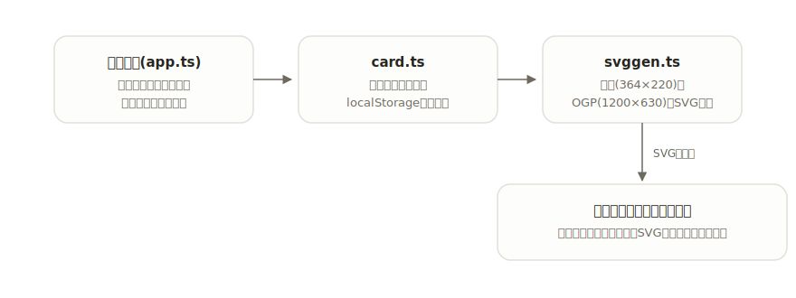

# meishi

[](https://github.com/miruky/meishi/actions/workflows/ci.yml)
[](https://github.com/miruky/meishi/actions/workflows/deploy.yml)

[](LICENSE)

**名前と肩書を入れるだけで、印刷向けの名刺とOGP画像をSVGで作るジェネレータ。**

公開ページ: https://miruky.github.io/meishi/

## 概要

meishiは個人の名刺(91×55mm)とOGP画像(1200×630)を同じ入力から作るツールである。名前・添え書き・肩書・所属・連絡先を入れ、アクセント色と地色(明・暗)を選ぶと、2種類のSVGがその場でプレビューされる。SVGとPNGのどちらでも保存でき、SVGコードのコピーや、入力をそのまま載せた共有リンクの発行もできる。空欄の項目はレイアウトから消えるので、載せたい情報だけの簡潔な仕上がりになる。

入力はブラウザのlocalStorageに保存され、サーバーには何も送らない。共有リンクも、内容をURLに載せるだけでサーバーを介さない。

### なぜ作ったのか

個人サイトやイベント用に名刺とOGPを揃えるとき、デザインツールを開くほどではないのに、テンプレートサービスは装飾過多でロゴや透かしが入る。文字情報だけの簡潔な名刺とOGPを、同じ配色・同じ内容で一度に作れる最小限の道具がほしかった。SVGで出すのは、印刷所への入稿前の調整や、あとからの文言修正がテキストエディタでできるからである。

## アーキテクチャ



入力の型と保存(`card.ts`)、SVG生成(`svggen.ts`)、画面(`app.ts`)を分け、SVG生成は文字列を返す純粋関数としてDOMなしでテストする。

## 技術スタック

| カテゴリ             | 技術                           |
| :------------------- | :----------------------------- |
| 言語                 | TypeScript 5(strict)           |
| ビルド               | Vite 8                         |
| テスト               | Vitest 4                       |
| リンタ・フォーマッタ | ESLint 9 / Prettier            |
| CI / 配信            | GitHub Actions / GitHub Pages  |
| 永続化               | localStorage(外部サービスなし) |

## 使い方

### 作る

フォームに入力すると、名刺とOGPのプレビューが即座に更新される。アクセント色は6色のプリセットか自由な色を選べ、名刺の地色は明・暗を切り替えられる。各プレビューには「SVG」「PNG」「コピー」のボタンがあり、ファイル保存と、SVGコードのクリップボードコピーができる。

### 共有とやり直し

「共有リンクをコピー」を押すと、入力内容をURLのハッシュに載せたリンクが手に入る。リンクを開いた相手の画面に同じ名刺が復元される(内容はURLに含まれるだけで、サーバーには送られない)。「見本に戻す」で初期の見本へ戻せる。

### 画面の配色

右上のトグルで、画面全体の配色を「端末に合わせる / 明るい / 暗い」の3状態で切り替えられる。選択はlocalStorageに残り、再訪時もちらつかずに復元される。名刺SVGの地色(明・暗)とは独立している。

### 出力の仕様

| 出力 | viewBox                           | 用途                   |
| :--- | :-------------------------------- | :--------------------- |
| 名刺 | `0 0 364 220`(1mm=4単位、91×55mm) | 印刷データの下地       |
| OGP  | `0 0 1200 630`                    | サイトの`og:image`の元 |

- 文字はパス化せず`text`要素のまま埋め込む。フォントは表示環境のシステムフォントに任せる。
- 空欄の項目は要素ごと出力しない。
- 文字列はすべてXMLエスケープされる。
- PNG書き出しはブラウザのcanvasでラスタライズする。名刺は4倍、OGPは2倍の解像度で保存する。

### 制約

- 入稿先がフォントの埋め込みやアウトライン化を要求する場合は、保存したSVGをIllustratorやInkscapeでアウトライン化する必要がある。
- OGPはSVGを直接受け付けるサービスが少ないため、書き出したPNGを配信する。
- 顔写真・ロゴ画像の配置には対応しない。文字情報だけの構成に絞っている。

## プロジェクト構成

- `index.html` — エントリポイント
- `src/main.ts` — 起動。ストアの初期化
- `src/app.ts` — フォームとプレビューの画面
- `src/icons.ts` — 線画SVGアイコン
- `src/style.css` — デザイントークンとスタイル(ライト・ダーク対応)
- `src/lib/card.ts` — 入力の型・検証・永続化
- `src/lib/svggen.ts` — 名刺・OGPのSVG生成
- `src/lib/png.ts` — SVGをcanvasでPNGに変換
- `src/lib/share.ts` — 入力をURLハッシュへ可逆エンコード
- `src/lib/theme.ts` — 画面配色(system / light / dark)の解決と永続化
- `docs/architecture.svg` — 構成図
- `.github/workflows/` — CI(lint・テスト・ビルド)とPagesデプロイ

## はじめ方

### 前提条件

- Node.js 22以上

### セットアップ

```bash
git clone https://github.com/miruky/meishi.git
cd meishi
npm install
npm run dev
```

### テストの実行

```bash
npm test
```

### Lintの実行

```bash
npm run lint
```

### ビルド

```bash
npm run build
```

GitHub Pagesではリポジトリ名のサブパスで配信されるため、デプロイ時は環境変数 `MEISHI_BASE=/meishi/` でViteの `base` を切り替える(`.github/workflows/deploy.yml` 参照)。

## 設計方針

- **ひとつの入力から複数の出力へ** — 名刺とOGPは情報源を共有し、配色も揃う。直すときは入力を1か所直せばよい。
- **空欄は消える** — 項目を埋めないことが「載せない」の表明になる。プレースホルダの文字が出力に紛れ込むことはない。
- **編集可能な出力** — 文字をパス化せず、構造の読めるSVGを出す。最終調整を他のツールやテキストエディタに開かれた形で渡す。
- **実寸を持った名刺** — 名刺のviewBoxは91×55mmに対応する比率で、印刷データに合わせるときの換算が単純になるようにした。

## ライセンス

[MIT](LICENSE)
